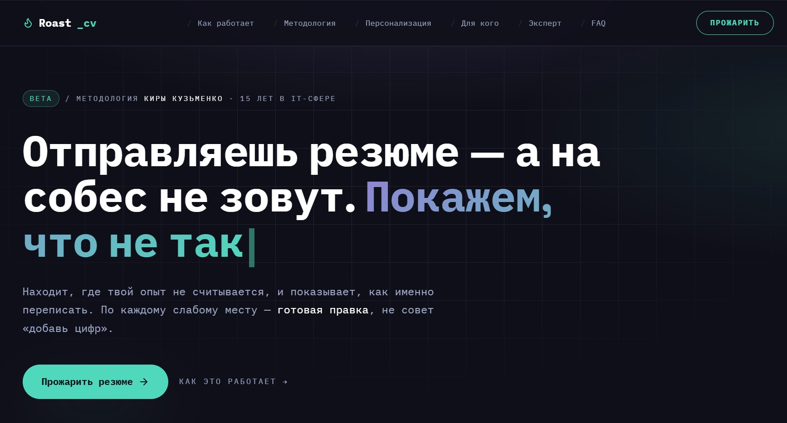
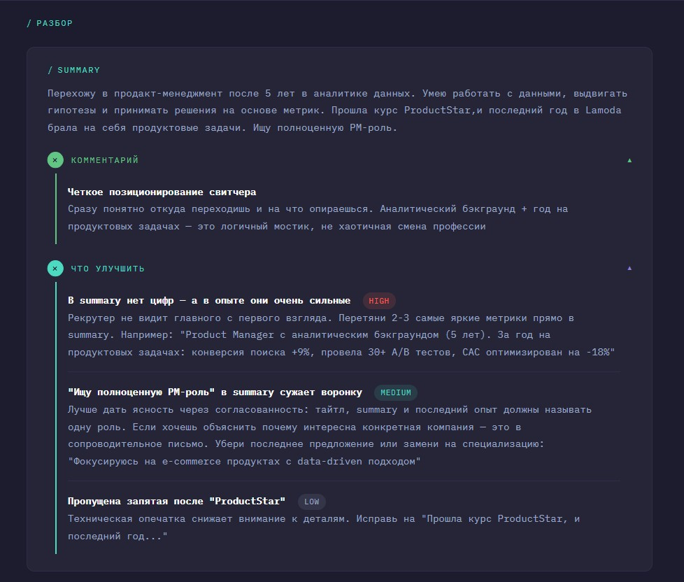
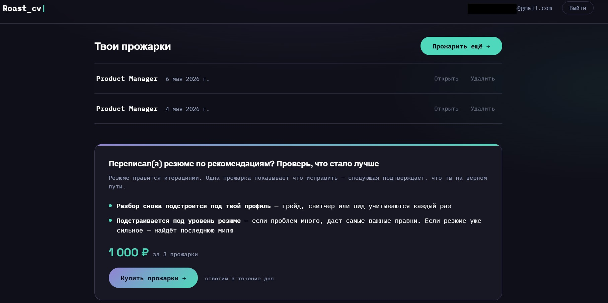

# Resume Roaster — AI-сервис для анализа резюме

Веб-сервис для IT-специалистов: вставляешь резюме — получаешь структурированный разбор по блокам с конкретными рекомендациями.

Сервис работает в production. Идёт закрытое тестирование с реальными пользователями — учениками карьерного курса [Hello New Job!](https://helloNewJob.ru).

---

## Проблема

Соискатели не понимают, что именно не так с их резюме. Фидбэк от рекрутеров либо отсутствует, либо слишком общий — «улучши формулировки». Из-за этого сложно понять, что конкретно менять, и конверсия откликов не растёт.

---

## Решение

AI-сервис, который разбирает резюме по блокам (summary, опыт, навыки, структура) и даёт приоритизированные рекомендации — от критичных до второстепенных. Методология основана на экспертизе HR-специалиста с 20-летним опытом в IT-найме.

**Флоу:**
1. Пользователь вставляет текст резюме
2. AI определяет целевую роль (или пользователь выбирает сам)
3. Разбор по блокам с оценкой приоритета каждой рекомендации
4. Пользователь оценивает качество фидбэка

---

## Что реализовано

- **Лендинг** — описание продукта, пример результата, FAQ, форма входа
- **Личный кабинет** — история прожарок, управление балансом, CTA на покупку при нулевом балансе
- **Авторизация** — magic link по email, без паролей
- **Админка** — управление пользователями и кредитами, просмотр прожарок с оценками
- **Retention-механики** — блок «Скоро в Прожарщике» с будущими функциями, подписка на обновления

---

## Демо

**Лендинг**


**Пример результата — разбор Summary**


**Личный кабинет — история прожарок и retention-блок**


---

## Ключевые продуктовые решения

**Модульная система промптов**
Промпт анализатора разбит на 6 файлов по темам (summary, опыт, навыки, карьерные паттерны и т.д.) вместо одного монолита. Причина: отдельные модули проще тестировать, улучшать и версионировать без риска сломать несвязанную логику.

**Версионирование промпта**
Каждая прожарка сохраняется с полем `prompt_version`. Это позволяет отслеживать, какой промпт дал какой результат, и принимать решения об улучшениях на основе данных, а не ощущений.

**Feedback loop**
После каждого анализа пользователь ставит оценку 0–5. Если оценка ниже 4 и пользователь дал согласие — результат сохраняется для улучшения промпта. Цикл: прожарка → оценка → улучшение → новая прожарка.

**Кредитная система**
Кредит списывается только при успешном анализе (валидный ответ AI, прошедший schema validation). Ошибка API — кредит не списывается.

**Data policy**
Текст резюме не хранится на сервере после анализа. Исключение — явное согласие пользователя для улучшения качества. Anthropic API подключён с zero data retention.

---

## Архитектура

```
Лендинг + личный кабинет (vanilla JS)
        ↓
    Node.js / Express API
        ↓
  Role Detector → Analyzer (Claude API)
        ↓
  Zod validation + retry
        ↓
  PostgreSQL (результаты, оценки, пользователи)
        ↓
  Admin panel + TG-алёрты при ошибках
```

**Деплой:** Railway

---

## Текущий статус

Идёт закрытое тестирование с реальными пользователями. Параллельно работает процесс отлова и починки багов: каждая прожарка оценивается, проблемные случаи фиксируются, исправляются и проверяются на регрессию.

Процесс устроен так, чтобы качество росло итеративно без ручной проверки каждого ответа — подробнее в [AI Evaluation Pipeline](https://github.com/mawer198735/ai-eval-pipeline).

Следующий шаг — открытый доступ с автоматической оплатой.

---

## Стек

- Node.js, Express
- Anthropic Claude API (claude-sonnet)
- PostgreSQL, SQLite
- Vanilla JS frontend
- Railway (деплой)

---

## Примечание

Промпты анализатора и методология оценки резюме не представлены в публичном доступе — это core IP продукта. Архитектура системы и продуктовые решения описаны выше в полном объёме.
