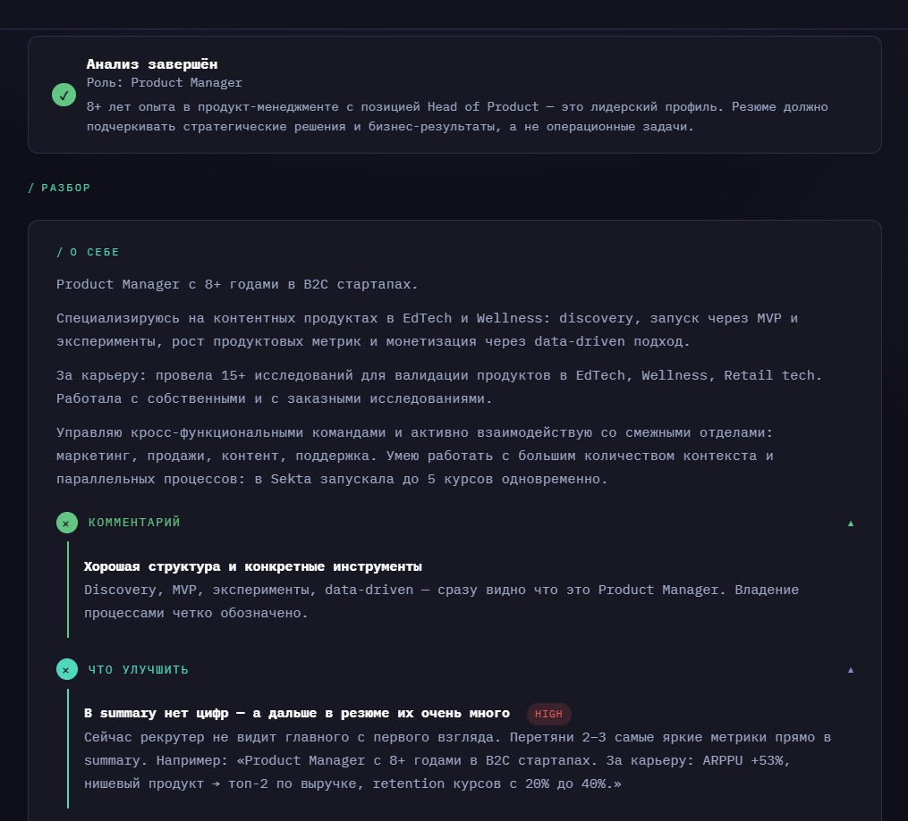
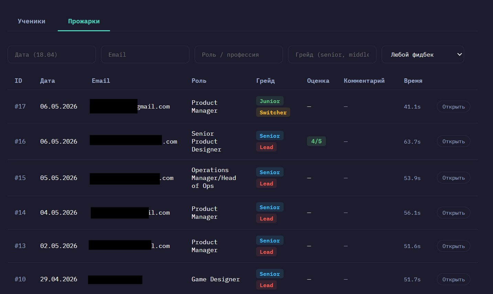
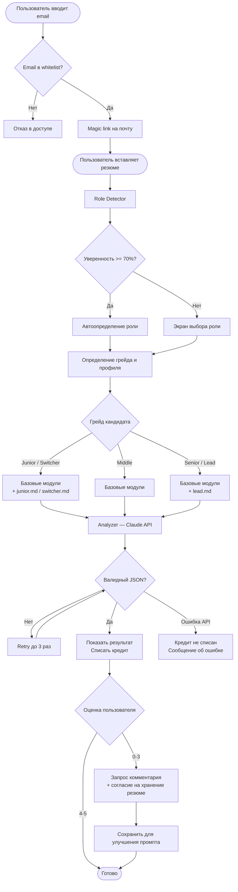

# Resume Roaster — AI-сервис для анализа резюме

AI-система для анализа резюме с встроенным feedback loop и evaluation pipeline. Не просто генерация советов — итеративный продукт, который улучшается на основе реальных пользовательских оценок и данных о качестве AI-ответов.

Сервис работает в production. Идёт закрытое тестирование с реальными пользователями — учениками карьерного курса [Hello New Job!](https://helloNewJob.ru).

**[→ Открыть сервис](https://resume-roaster-production.up.railway.app)**

---

## Проблема

Соискатели не понимают, что именно не так с их резюме. Фидбэк от рекрутеров либо отсутствует, либо слишком общий — «улучши формулировки». Из-за этого сложно понять, что конкретно менять, и конверсия откликов не растёт.

---

## Решение

AI-сервис, который разбирает резюме по блокам (summary, опыт, навыки, структура) и даёт приоритизированные рекомендации — от критичных до второстепенных. Методология основана на экспертизе HR-специалиста с 20-летним опытом в IT-найме.

---

## Что реализовано

- **Лендинг** — описание продукта, пример результата, FAQ, форма входа
- **Личный кабинет** — история прожарок, управление балансом, CTA на покупку при нулевом балансе
- **Авторизация** — magic link по email, без паролей
- **Админка** — управление пользователями и кредитами, просмотр прожарок с оценками
- **Retention-механики** — блок «Скоро в Прожарщике» с будущими функциями, подписка на обновления

---

## Демо

**Лендинг**


**Результат анализа — заголовок с ролью и разбор по блокам**



**Личный кабинет — история прожарок и retention-блок**


**Админка — управление пользователями и просмотр прожарок**


---

## Флоу и развилки



---

## Product Decisions

**Одна бесплатная прожарка — не маркетинг, а гипотеза**
Цель — валидировать core value до монетизации. Если первый анализ не полезен, платная версия не спасёт продукт. Ограничение заставляет фокусироваться на качестве AI-ответа, а не на объёме трафика.

**Feedback collection после каждого анализа**
Качество LLM сложно измерить изнутри. Пользовательская оценка 0–5 — единственный надёжный сигнал о том, помогли ли рекомендации. Оценки ниже 4 с согласия пользователя сохраняются как данные для улучшения промпта.

**Админка с первого дня**
Без visibility в то, что происходит в production — летишь вслепую. Админка делает feedback loop наблюдаемым: какие роли анализируются чаще, где низкие оценки, кто из пользователей активен.

**Модульный промпт вместо монолита**
Монолитный промпт ломался непредсказуемо: правишь одно — едет другое. Разбивка на 6 файлов по темам (summary, опыт, навыки, карьерные паттерны) позволяет тестировать и улучшать каждую часть изолированно.

**UX намеренно упрощён на этапе валидации**
Каждый час на UX-полировку — это час не на качество промпта. Упрощённый интерфейс удерживает фокус на главном вопросе: помогает ли AI-анализ реальным пользователям?

**Кредит списывается только при успехе**
Кредит списывается только при успешном анализе — валидный JSON, прошедший schema validation. Ошибка API или невалидный ответ — кредит не списывается. Это доверие пользователя к продукту.

---

## Архитектура

```
Лендинг + личный кабинет (vanilla JS)
        ↓
    Node.js / Express API
        ↓
  Role Detector → Analyzer (Claude API)
        ↓
  Zod validation + retry
        ↓
  PostgreSQL (результаты, оценки, пользователи)
        ↓
  Admin panel
```

**Деплой:** Railway

---

## Текущий статус

Идёт закрытое тестирование с реальными пользователями. Параллельно работает процесс отлова и починки багов: каждая прожарка оценивается, проблемные случаи фиксируются, исправляются и проверяются на регрессию.

Процесс устроен так, чтобы качество росло итеративно без ручной проверки каждого ответа — подробнее в [AI Evaluation Pipeline](https://github.com/mawer198735/ai-eval-pipeline).

Следующий шаг — открытый доступ с автоматической оплатой.

---

## Стек

- Node.js, Express
- Anthropic Claude API (claude-sonnet)
- PostgreSQL
- Vanilla JS frontend
- Railway (деплой)

---

## Выводы и текущие вызовы

**Самое сложное — оценка качества AI-ответов.**
LLM может звучать уверенно, но давать неверные рекомендации. Именно поэтому появилась отдельная система оценки — без неё невозможно понять, улучшился продукт или деградировал после правки промпта.

**Модульные промпты решили проблему итерации.**
Монолитный промпт ломался непредсказуемо: правишь одно — едет другое. Разбивка на 6 модулей по темам позволила менять и тестировать каждую часть изолированно.

**UI намеренно упрощён на этапе валидации.**
Фокус — на проверке core value: помогают ли рекомендации. Дизайн и UX-полировка — следующий этап после подтверждения качества AI-анализа.

**Регрессионный контроль стал критичным.**
После первых фиксов выяснилось: починка одного бага ломала другой сценарий. Без regression tracking это невозможно поймать систематически.

---

## Примечание

Промпты анализатора и методология оценки резюме не представлены в публичном доступе — это core IP продукта. Архитектура системы и продуктовые решения описаны выше в полном объёме.
